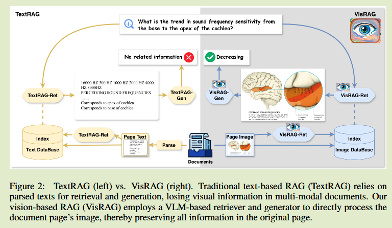

# VisRAG: Vision-based Retrieval-augmented Generation on Multi-modality Documents 

这篇吧带图片的网页作为VLM的输入来处理视觉和文本交错出现的问题。不是我想要的。

## Introduction 

传统RAG方法主要针对与文本数据而忽略了图像信息，尽管有些方法开始对图像检索和多模态RAG进行研究，但这些方法主要集中在预定义的场景中，图像和描述性文本被提前提取并配对，这与显示中文本图像在单个文档页面中交错出现的场景不同。

视觉语言模型VLMs的发展为理解图像和文档中的复杂视觉线索提供了一种很有前途的方法。能否将TextRAG的检索和生成组件中的基本语言模型替换为VLMs，来绕过解析阶段并保留文档的所有信息？

我们提出基于视觉检索增强生成VisRAG，来研究使用VLM构建纯视觉RAG流水线的可行性。VisRAG由基于VLM的检索器VisRAG-Ret和神提成器VisRAG-Gen构成，VisRAG-Ret继承了基于文本的稠密检索器的双编码器，将查询和文档映射到一个嵌入空间，但不依赖于提取的文本内容，直接利用文本的图像。

我们还提出页面拼接技术和加权选择技术，以实现对多个文档的处理，VisRAG以原始的视觉格式保存所有信息，来比卖你传统RAG中可能出现的潜在信息丢失或失真的问题。

## Method

#### Preliminary: Retrieval-Augmented Generation

一个典型的RAG流水线由一个检索器和一个生成器组成，都建立在大型语言模型LLM上，在一个知识语料库D上运行，将其处理为单元进行检索和生成，记为$D = \{ d_1, d_2, ..., d_n\}$，n表示检索单元的个数，给定一个文本查询q和检索语料D，检索函数表示为$R:(q,D) \rightarrow D_R$，以q 和 D 为输入，产生一个候选集$D_R \subset D$，语料库D中的单元会预先编码，在进行推理时会通过近似最近邻搜索来检索$D_R$作为生成的知识源。生成过程定义为一个函数$G:(q, D_R) \rightarrow a$，a表示答案，G表示LLM生成器。

#### VisRAG: Vision-based Retrieval-augmented Generation

##### 检索 Retrieval

VisRAG第一阶段旨在根据q从给定的语料库D中检索出一组网页，遵循基于文本的密集检索模型的双编码器范式，使用VLM进行编码。

在VLM中，***查询和页面分别编码为文本和图像***，以隐藏状态序列的形式产生，为了得到最终的嵌入，考虑使用带有因果注意力的生成式VLM，在最后一层VLM的隐藏状态上采用位置加权的均值池化，为后面的token赋予更高的权重：
$$
v = \sum^S_{i=1}w_ih_i
$$
$h_i$表示第i个隐藏状态，S表示序列长度，$w_i = \frac{1}{\sum^S_{j=1}j}$为第i个隐藏状态的权重，v表示查询或页面的向量表示，通过查询和页面向量的余弦相似度计算相似度得分，利用InfoNAC损失函数对检索器进行优化：
$$
l(q, d^+,D^-) = -log \frac{exp(s(q,d^+) / \tau)}{exp(s(q,d^+) / \tau) +  \sum_{d^-\in D^-}exp(s(q,d^-)/\tau)}
$$
$d^+ D^-$表示关于查询q的正样本和负样本集合，s(·)表示相似度分数。

##### 生成 Generation

VisRAG的第二阶段重点是根据用户的查询和使用VLM检索的页面生成答案。

###### 页面拼接

一种直接的方法是将$D_R$中所有的页面拼接成一幅图像，以迎合大多数可以接受单张图像的VLM模型：
$$
a \leftarrow VLM-Single(q, concat(\{ d| d\in D_R\}))
$$
VLM-Single表示能够接受一张图像和文本提示的VLM模型。

###### 权重选择

另一种方法是让VLM从top-k中为每个页面生成一个答案，并选择一个具有最高置信度的最终答案，最终的置信度定义为答案的加权生成概率：
$$
P(a | q, D_R) = P(a | q,d) · \lambda(q, d)
$$
$P(a|q, d)$为以单篇文档d为条件生成答案a的置信度的倒数，$\lambda$为归一化检索得分：
$$
\lambda(q, d) = \frac{exp(s(q, d))}{\sum_{d'\in D_R}exp(s(q, d'))}
$$

###### VLM接受多幅图像

最新的VLM方法，被设计和训练以接受多幅图像作为输入来执行跨图像推理，这种能力可能对生成有用，因为有些问题所需信息可能分散到多个页面上：
$$
a \leftarrow VLM-Multi(q, \{ d | d\in D_R \})
$$
VLM-Multi为接受文本提示的多幅图像的VLM